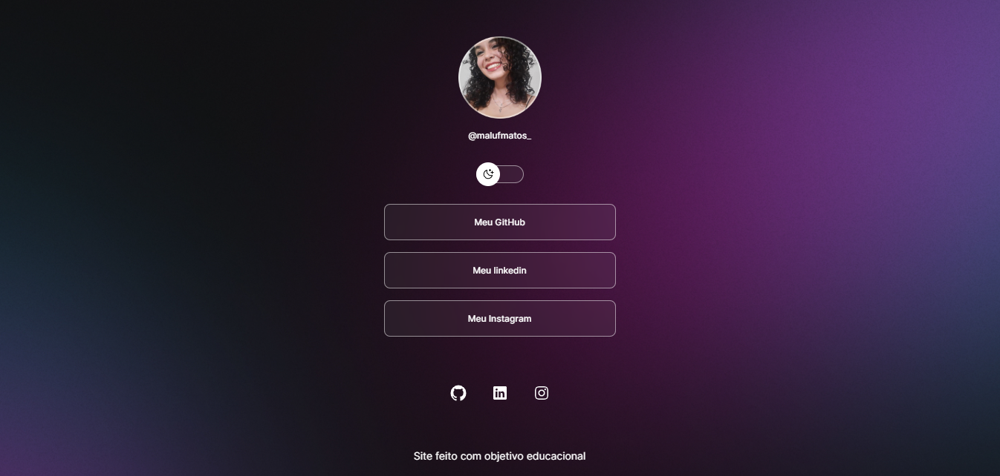
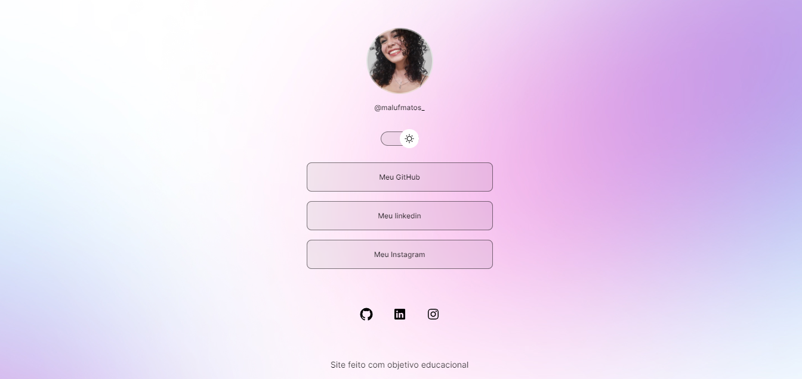

<h1 align="center"> SocialLinks </h1>

  

  

 

## 🚀 Tecnologias

Esse projeto foi desenvolvido com as seguintes tecnologias:

- HTML e CSS
- JavaScript
- Git e Github
- Figma

## 💻 Projeto

O DevLinks é um agregador de links para usar como cartão de visitas online.

- [Acesse o projeto finalizado, online](https://maykbrito.github.io/devlinks)
